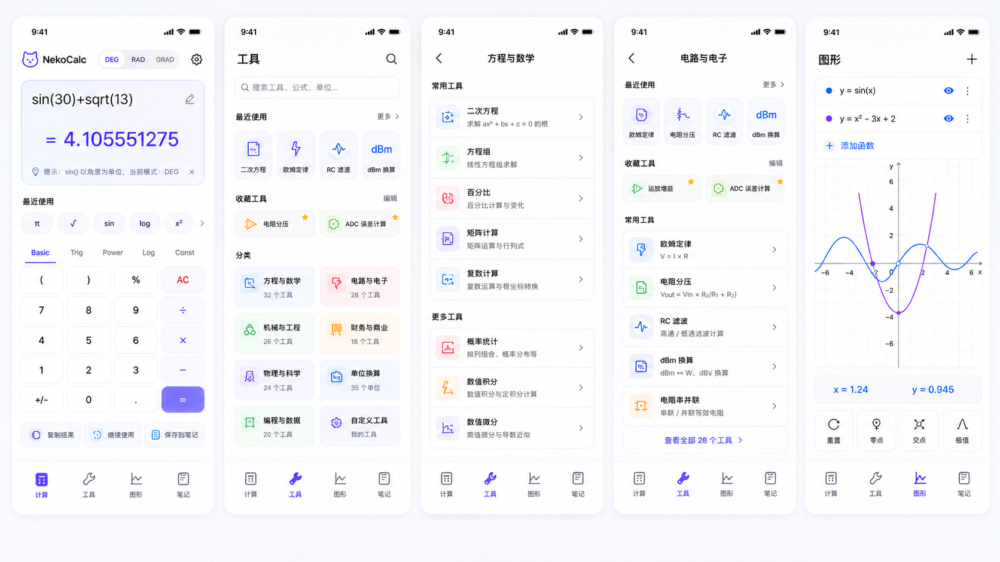
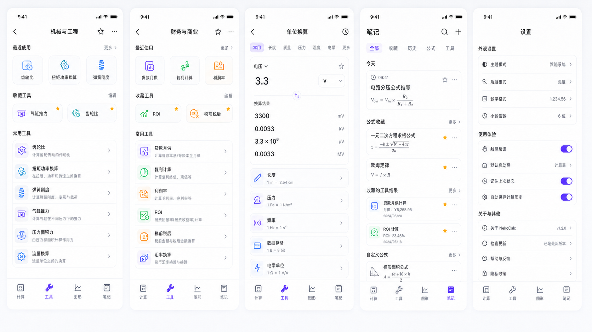
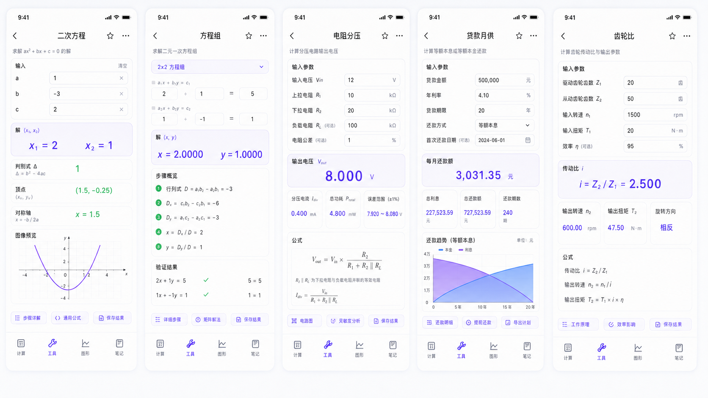

# NekoCalc

一个面向 Android 的 Flutter 计算工具箱。NekoCalc 把日常计算、科学函数、工程工具、单位换算、函数图形和本地笔记放在同一个轻量工作台里，适合学习、调试、估算和移动端快速记录。

<p>
  
  
  
  
</p>

## 预览

<p>
  
  
  
</p>

## 功能

- 计算器：基础运算、科学函数、三角函数、幂函数、常数输入、角度/弧度模式、记忆寄存器。
- 工具箱：数学、电路电子、机械工程、财务商业、物理科学、单位换算、编程数据工具。
- 数据分析：支持 Excel 风格列表数据拟合、散点图、拟合曲线、R²、RMSE、拟合值和残差表。
- 工程校核：工具结果包含公式、输入摘要、误差范围、边界条件和场景限制。
- 图形：函数绘制、拖拽缩放、零点/交点/极值标记与点选查看。
- 笔记与历史：计算历史、工具结果、个人笔记均存储在本机 SQLite。
- 数据管理：通过 JSON 备份/恢复历史、笔记、收藏、最近工具和设置。
- 体验：启动动画、深色模式、夜间图标、触感反馈、状态恢复。

## 架构

项目采用 Feature-first + Clean Architecture 简化版，核心目标是让页面、状态、计算逻辑和数据持久化保持清晰边界。

```text
lib/
├── app.dart                         # 应用根节点：主题、设置注入、启动壳装配
├── main.dart                        # Flutter 入口
├── application/                     # Controller、应用设置、状态编排
├── core/                            # 数学解析、单位换算、格式化、常量
├── data/                            # SQLite、本地模型、持久化
├── domain/                          # 实体、工具目录、计算 UseCase、校核逻辑
├── features/                        # 按功能组织页面与交互
└── shared/                          # 应用壳、启动页、主题和通用组件
```

更多说明见 [docs/file_structure.md](docs/file_structure.md) 和 [docs/architecture.md](docs/architecture.md)。

## 运行

环境要求：

- Flutter 3.x
- Android SDK
- Android Studio 或命令行 Gradle 环境

常用命令：

```bash
flutter pub get
flutter analyze
flutter run
```

构建通用 APK：

```bash
flutter build apk --release
```

按 ABI 拆分发布包：

```bash
flutter build apk --release --split-per-abi
```

构建产物位于：

```text
build/app/outputs/flutter-apk/app-release.apk
build/app/outputs/flutter-apk/app-arm64-v8a-release.apk
build/app/outputs/flutter-apk/app-armeabi-v7a-release.apk
build/app/outputs/flutter-apk/app-x86_64-release.apk
```

## Android Studio

打开项目根目录，也就是包含 `pubspec.yaml` 的目录。Flutter Android 宿主工程位于 `android/`，不要再使用旧式根级 `app/` 模块。

如果本机 Flutter 安装缺少 `packages/flutter_tools/gradle`，项目会优先使用本地 `.flutter/flutter_tools_gradle` 兼容层。该目录属于机器缓存，已被 `.gitignore` 忽略；重新同步前可由本机环境生成或保留。

## 发布

本地测试构建可以不配置正式签名；当 `android/key.properties` 存在时，Gradle 会自动使用正式 release keystore。配置模板见 `android/key.properties.example`，真实 keystore 和 `key.properties` 不进入 git。

发布前按 [Release Checklist](docs/release_checklist.md) 执行完整检查。

## 数据

NekoCalc 当前只使用本机 SQLite：

- 计算历史
- 工具结果历史
- 收藏工具
- 设置项
- 笔记
- JSON 备份与恢复

数据不会上传到网络服务。

完整隐私说明见 [Privacy Policy](PRIVACY.md)。

## 文档

- [架构说明](docs/architecture.md)
- [Demo 记录](docs/demo.md)
- [文件结构](docs/file_structure.md)
- [发布检查清单](docs/release_checklist.md)
- [隐私政策](PRIVACY.md)
- [更新日志](CHANGELOG.md)

## 状态

当前版本：`v1.0.0`

1.0 正式版重点放在科学计算器、工程工具、函数图形、数据拟合、本地笔记、SQLite 备份恢复、触感反馈和按 ABI 拆分发布包。后续版本适合继续补充图表导出、更多拟合模型和更完整的工程校核模板。
